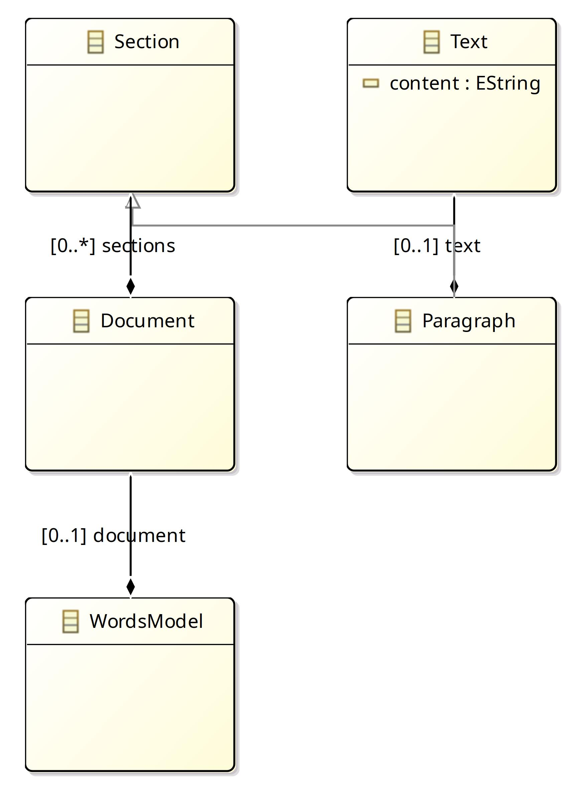

# org.agileware.natural.words

Proving grounds for smart text mining in [Natural](https://github.com/rlogiacco/Natural)

## Goals

This project defines the `Words` language, an Xtext Dsl for processing free form text 
into semantic groups and tokens. Currently the primary goal of this project is to implement
a few common patterns used in the `Cucumber` and `Jbehave` languages used in `Natural` 
by providing capabilities to match: 

* Sections with `Keyword: And a title`
* Blocks of *mostly* free-form multi-line text
* Single lines of text that start a specific group of words
* Symbolic word(s) in text such as `<keyword>`, `"String of text"`, or `-9.8m/s`

Once this has been accomplished, the project inception process will begin in order 
to discover further potential text mining capabilities.

## Words Model

This is a work in progress and subject to frequent change.

